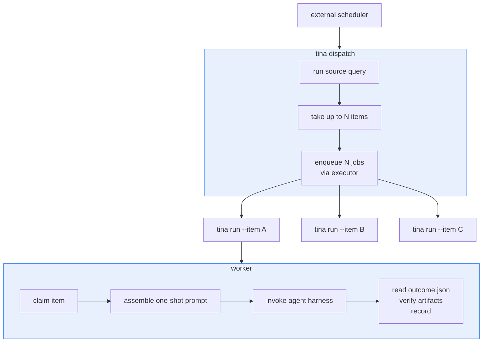
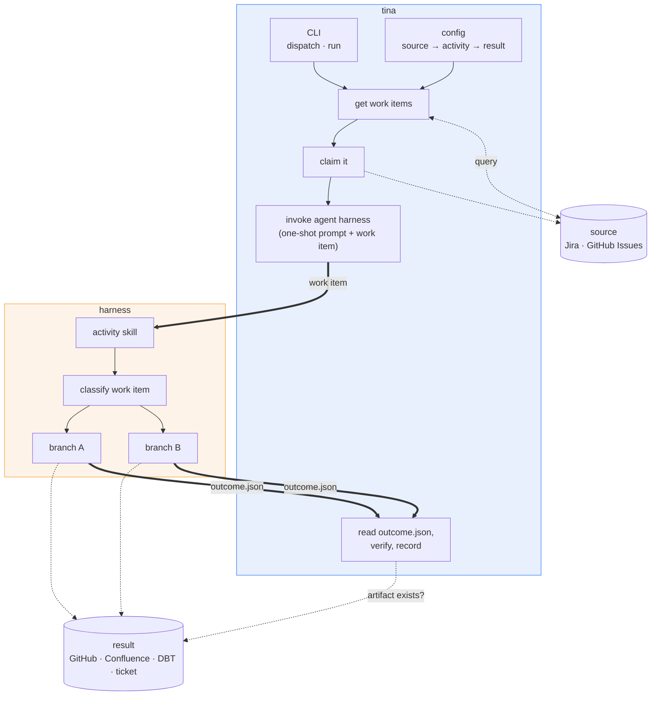
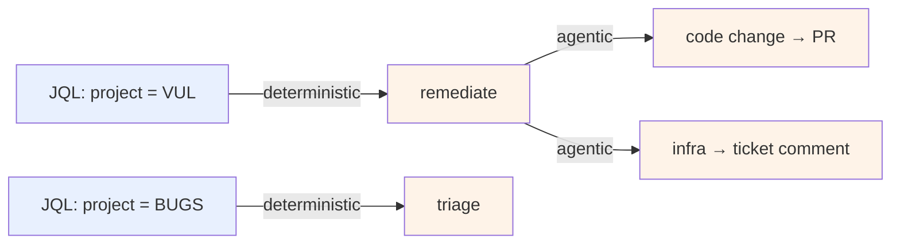
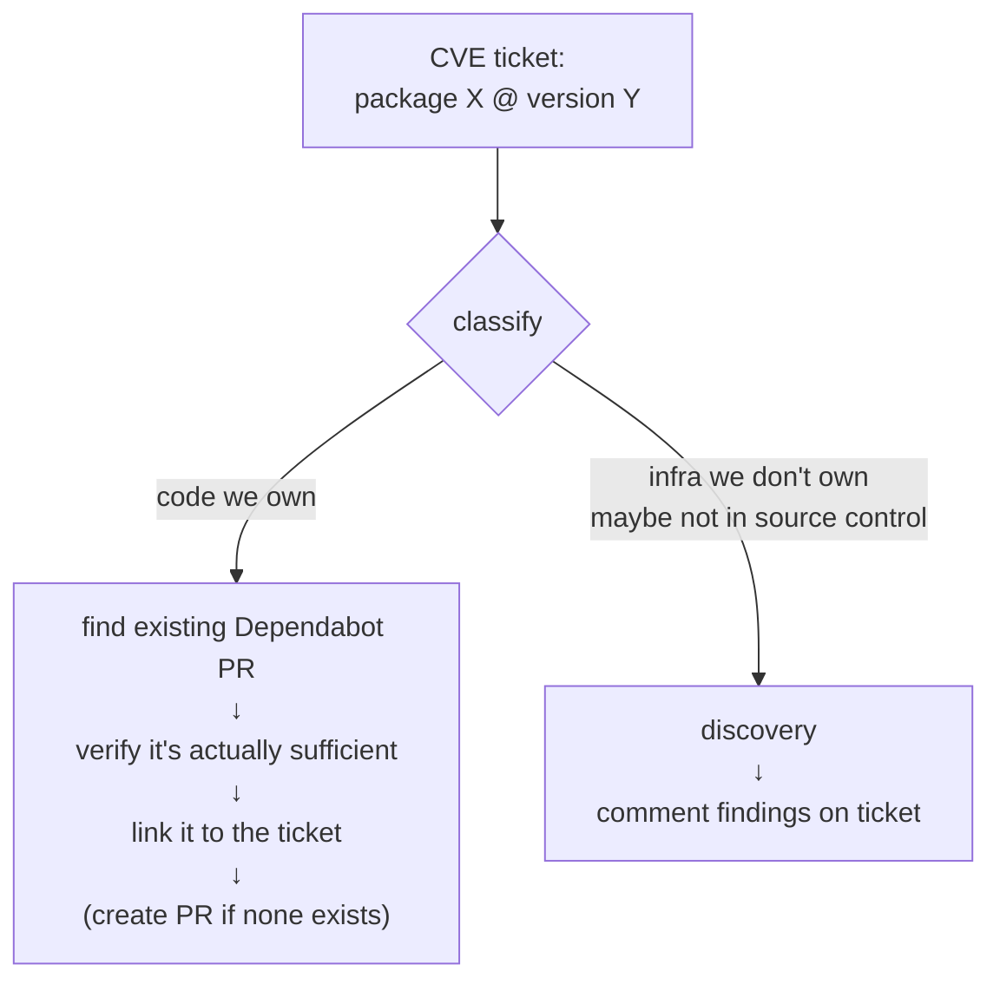
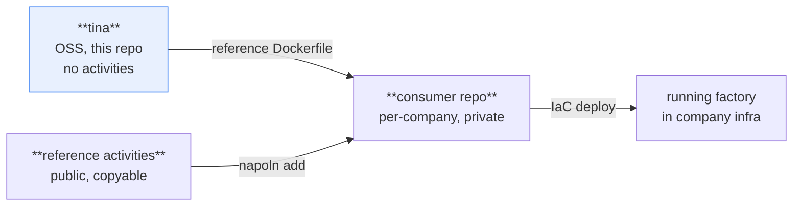

# Tina Architecture

---

## 1. What it is

An autonomus factory takes in pre-defined work items and produces work items that are relatively easily verified by a person and potentially with the right criteria, an agent.

Tina is an agent harness with guardrails. The factory does orchestration only.
The agent does all the performance, using its own tools.

---

## 2. Pieces

**Factory** — a Python package that selects a work item and calls an agent with a
single one-shot prompt containing that work item. Orchestration only.

**Agent harness** — invoked by the factory as a subprocess. Reference
implementation is pi, chosen because it has the smallest feature set. Claude
Code, Gemini CLI, and others are supported through the same adapter contract.

---

## 3. Entrypoints

Tina is a library with a CLI in front of it. Two subcommands:

```
tina dispatch --workflow vul --limit 5     # what the scheduler calls
tina run --workflow vul --item VUL-123     # what the executor spawns; also local dev
```

Tina does not own scheduling. There is no open standard for declaring a schedule
that targets native cloud schedulers, and cron dialects are not even portable
across them (EventBridge uses 6 fields with `?` and a year; GCP, k8s, and
Cloudflare use 5-field unix). So cron is not a mode — it is an external scheduler
calling `tina dispatch`. Cloud Scheduler, EventBridge, k8s CronJob, systemd
timers, and GitHub Actions `schedule:` all work without Tina knowing.

A REST/webhook entrypoint is deliberately deferred. It needs a long-lived
listener, auth, payload validation, and a normalize path per source, and it only
pays off when reaction latency matters more than poll latency.

---

## 4. Workflows

A workflow is `Source -> Activity -> Result`.

| Workflow | Source | Activity | Result |
|---|---|---|---|
| Vulnerability | Jira ticket (VUL, open, unassigned) | Remediate | PR linked on ticket, *or* discovery comment on ticket |
| Bug | Jira ticket filed | Triage | Respond on ticket |
| Spike | Linear ticket | Discovery work | Confluence document |
| New data pipeline | Asana ticket | Discover where to make the change | New DBT config |

Reading across the examples:

- **Source** is always a ticket tracker, selected by a query. The tracker varies
  (Jira, Linear, Asana), so the source is an adapter plus a query string.
- **Activity** is the agent work, expressed as a skill. It is the variable part.
- **Result** is an artifact in some other system. In most examples the result
  system is not the source system.

The agent produces the result with its own tools. Tina never writes it. So
`result` is a declaration, not a runtime component — useful for verification and
for knowing which credentials the image needs.

One activity can produce different results per run: the vulnerability activity
ends in a PR link or a discovery comment depending on what it finds. Results are
not 1:1 with workflows.

---

## 5. Dispatch and worker

Two roles, one image.

**Dispatcher** runs the source query, takes up to N items, and enqueues N worker
jobs through an executor. It never runs an agent.

**Worker** takes a single work item identifier, claims it, runs the agent once,
and records the outcome. One item = one run = one container = one log stream.

Throughput scales by fanning out workers, not by concurrency inside a single
process. A dispatcher invocation stays short and bounded; only workers are long
and variable, which keeps them clear of scheduler timeouts.



---

## 6. High level architecture



---

## 7. Two levels of dispatch

Two dispatch decisions, at different levels, working differently:

| | Workflow selection | In-activity classification |
|---|---|---|
| **Decides** | which activity handles this queue | which branch handles this item |
| **Mechanism** | query in config | rules inside the activity's prompt |
| **Determinism** | deterministic | agentic |
| **Owned by** | Tina | the activity |
| **Auditable by** | reading config | reading the transcript |



Tina never inspects the content of a work item. It only knows the item matched a
query. All judgment about what the item actually is happens inside the activity.

---

## 8. Source adapters

| Operation | Used by | Purpose |
|---|---|---|
| `query()` | dispatcher | run the configured query, return work items |
| `claim(item)` | worker | mark the item as taken; fail if already claimed |
| `normalize(payload)` | deferred | turn an inbound webhook payload into a work item |

v1 ships **Jira** and **GitHub Issues**. Two adapters, not one — a single
implementation makes the interface accidentally Jira-shaped, and an OSS project
that cannot be tried without a Jira instance will not get used. GitHub Issues is
the demo path.

---

## 9. Claiming

The tracker is the ledger. Tina holds no persistent state — no database, no local
state file, restartable containers, multiple invokers safe by default.

**The worker claims, not the dispatcher.** Claiming assigns the ticket to the bot
user or applies a label, and the configured query excludes claimed items — which
is what `unassigned = TRUE` is already doing in the work implementation.

This is a choice between failure modes:

| | Failure mode |
|---|---|
| Worker claims | dispatch can enqueue an item twice; losers exit `no_action_needed`. Self-healing. |
| Dispatcher claims | no duplicates, but a dispatcher dying mid-loop leaves items claimed and unworked, needing a sweeper. |

Self-healing wins. Duplicate containers that exit in seconds are cheap; stuck
items need human recovery.

Consequence: worker start is `claim() → if already claimed, exit
no_action_needed`. That check needs to be atomic enough per tracker to not
double-run. Jira assignment is a real compare-and-set if conditioned on assignee
being empty. GitHub's assign API is an idempotent add with no conditional, so
GitHub claiming is racy — mitigate with assign-then-reread, and exit
`no_action_needed` if not the sole assignee. A small window remains, which is
acceptable because duplicate workers are already the tolerated failure mode.

---

## 10. Executors

The executor is how the dispatcher enqueues workers.

| Executor | Mechanism |
|---|---|
| `local` | subprocess. Dev and CLI use. |
| `cloudrun` | create a Cloud Run job execution against the same image. |

v1 ships both. `local` is not optional — it is how anyone tries Tina. A single
executor would make the interface accidentally Cloud Run-shaped. k8s Jobs, ECS,
and others come later.

---

## 11. Guardrails

Tina is an agent runner with a small number of constraints. Today there are two:

1. **One-shot prompt.** No interactive loop. The agent gets the work item and the
   activity prompt, runs once, exits.
2. **Container tool surface.** The agent can only do what is installed in the
   image. Currently one image for all workflows.

---

## 12. Harness adapters

Every supported harness is a CLI. The adapter builds argv, passes the prompt,
runs a subprocess, and collects the result — small enough to be declarative
config rather than a code plugin:

```toml
harness = "pi"                  # which one to use

[harnesses.pi]
command = ["pi", "--prompt-file", "{prompt_file}"]

[harnesses.claude]
command = ["claude", "-p", "@{prompt_file}", "--output-format", "json"]
```

Singular `harness` selects; plural `[harnesses.<name>]` defines. TOML will not let
one key be both a string and a table, so the two cannot share a name. `executor`
and `[executors.<name>]` work the same way.

**Tina does not parse harness stdout.** Each harness reports differently, and
parsing per-harness output is where swappability rots. Instead Tina passes an
output path in the prompt and instructs the agent to write `outcome.json` there
before finishing. Every harness can write a file, so the contract is
harness-independent. Exit code is the fallback for "the agent died before
writing."

---

## 13. Outcome contract

Model what Tina should do next, not what happened.

```json
{
  "outcome": "resolved | no_action_needed | needs_human | failed",
  "details": "free-form prose — unmodeled, as much as it wants",
  "artifacts": [{ "kind": "github:pr", "url": "..." }]
}
```

Four terminal states. Permission failures are `failed` plus a prose string — that
never needed a rich type, it needed somewhere to put text. `needs_human`
separates "this run broke" from "this run correctly concluded a person must
decide," which is where the infra branch lives permanently.

Inputs can be constrained; outputs resist a contract, because real runs terminate
in wildly varying ways. This is why only the enum is modeled and `details` stays
prose.

---

## 14. Verification

When `outcome` is `resolved` and `artifacts` are declared, Tina confirms each
artifact exists. The other three states have nothing to check.

v1 does a **generic** check: HTTP GET each URL using credentials already in the
environment. This catches the dominant failure — an agent reporting `resolved`
with a PR URL it never opened — for very little code. Typed per-`kind` verifiers
(PR is open, targets the right repo, is non-empty) would be a third adapter
family alongside sources and executors, and would triple the v1 surface to catch
failures not yet observed.

On mismatch, do not overwrite the agent's report. Record `outcome: resolved` plus
`verified: false`, and flip the effective status to `needs_human`. Preserving the
claim is what makes it possible to debug an activity that lies.

Tina needs read credentials for result systems, which it does not need today.
They are already in the image for the agent, so this is env reuse rather than new
secrets plumbing.

---

## 15. Configuration

```toml
harness = "pi"                  # selects [harnesses.pi]
executor = "cloudrun"           # selects [executors.cloudrun]
activities_dir = "activities"   # where napoln installed the skills

[harnesses.pi]
command = ["pi", "--prompt-file", "{prompt_file}"]

[executors.cloudrun]
project = "acme-prod"
region = "us-central1"
job = "tina-worker"

[vul]
source = "jira"
query = "project = VUL AND status = Open AND assignee IS EMPTY"
activity = "remediate"      # skill under activities_dir; defaults to the key
result = "github:pr"        # declaration only

[bug]
source = "github"
repo = "acme/api"           # required for the github source
query = "repo:acme/api is:issue is:open no:assignee label:bug"
activity = "triage"
result = "github:issue-comment"
```

Every table that is not `harnesses` or `executors` is a workflow, keyed by its
table name. Unknown keys are rejected rather than ignored.

The work implementation this is derived from used a Jira-bound schema:

```toml
[vul]
track = 'tracks/vul'
jql = "project = VUL AND status in open and unassgined = TRUE"
```

`jql` binds the schema to one tracker. `source` + `query` generalizes it.

---

## 16. Activity anatomy

An activity is a skill with a constrained input shape. It may contain multiple
branches, distinguished by classification rules in its prompt.

Example — the vulnerability activity:



---

## 17. Distribution

Three artifacts, of which this repo is one:



Activities are installed with [napoln](https://github.com/raiderrobert/napoln),
since they are a kind of skill. **Tina contains no fetching code**: the consumer's
image build runs `napoln install`, skills land on disk, and Tina reads them from
a directory. Versioning, pinning, and three-way-merge upgrades are napoln's job.

---

## 18. v1 scope

| Area | v1 |
|---|---|
| Language | Python |
| Entrypoints | CLI only — `dispatch`, `run` |
| Scheduling | not owned; external schedulers call `dispatch` |
| Concurrency | one item per worker; fan out via executor |
| Sources | Jira, GitHub Issues |
| Executors | `local`, `cloudrun` |
| Harnesses | pi (reference), Claude Code |
| Claiming | worker claims; tracker is the ledger; no persistent state |
| Verification | generic artifact-URL existence check |
| Activities | none shipped; installed via napoln |

Deferred: REST/webhook entrypoint, `normalize(payload)`, typed result verifiers,
per-workflow images, stuck-claim sweeper, Linear and Asana adapters, k8s and ECS
executors.

---

## 19. Prior design

This repo previously documented a three-layer agent harness toolkit (`tina-ai`,
`tina-agent`, `tina`) with a long-lived polling autonomous loop. That design is
superseded by this document and recoverable from git history. Shipping a native
harness may be revisited later; it would become another entry in §12 rather than
a change to this architecture.
